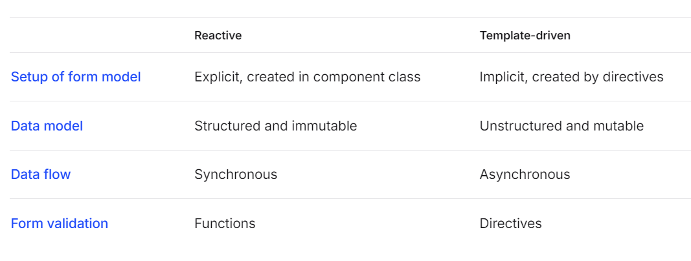

# EMSHandsOn

### ng Forms
- Reactive Forms
- Template Driven Forms (current usage)

### HTTP Client Service
HTTP methods
- GET (read)
- POST (create)
- PUT (update)
- DELETE

### Data flow from ng component -> database

                                  +---------------+
                                  |  Angular      |
                                  |  Component    |
                                  +---------------+
                                            |
                                            |  (Request)
                                            v
                                  +----------------+
                                  |  Angular       |
                                  |  Service       |
                                  |  (HTTP Service)|
                                  +----------------+
                                            |
                                            |  (HTTP Request)
                                            v
                                  +---------------+
                                  |   REST API    |
                                  |               |
                                  +---------------+
                                            |
                                            |  (Request)
                                            v
                                  +---------------+
                                  |  Spring Boot  |
                                  |  Application  |
                                  +---------------+
                                            |
                                            |  (Query)
                                            v
                                  +---------------+
                                  |  Database     |
                                  |  (DB)         |
                                  +---------------+