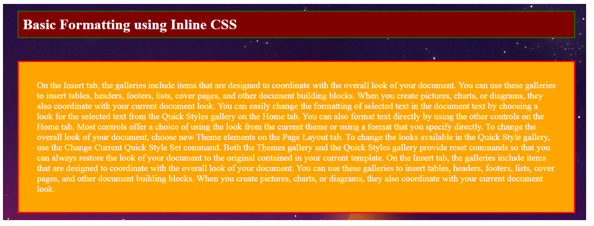
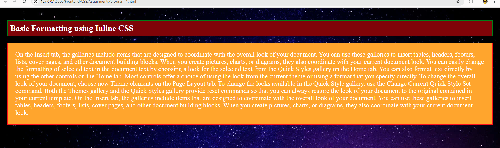
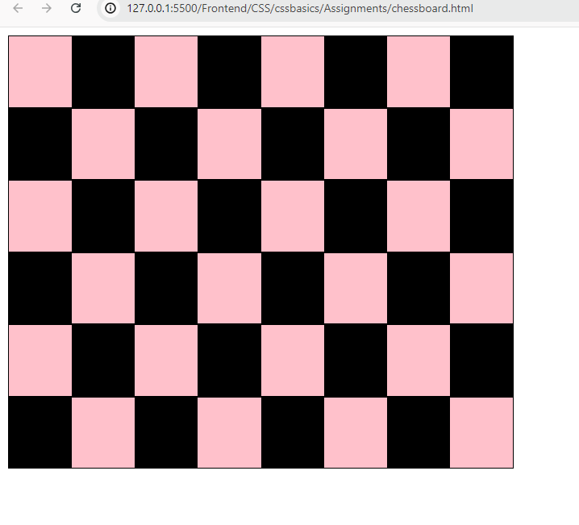
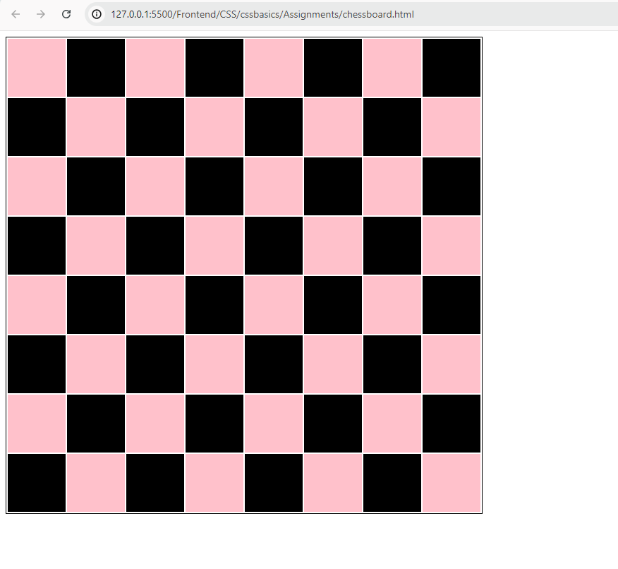
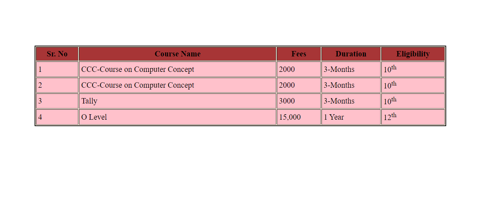

## CSS ASSIGNMENT

### Q1. Design and Apply style using inline CSS as in the image below.

### output

### Q2. Design and Apply style using CSS as in the image below. (Note : Use Div / Table Tag)
 - METHOD 1 <- Using Div Tag
### output

- METHOD 2 <- Using Table Tag

### output

### Q3 Design and Apply style using CSS as in the image below. (Note : Use Internal CSS).

### output

