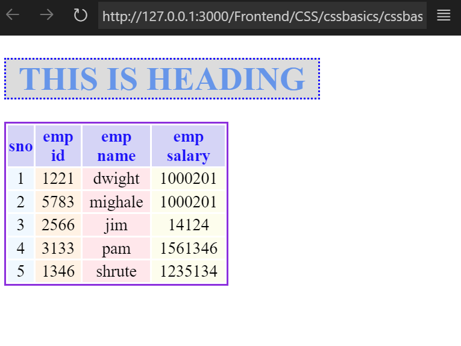
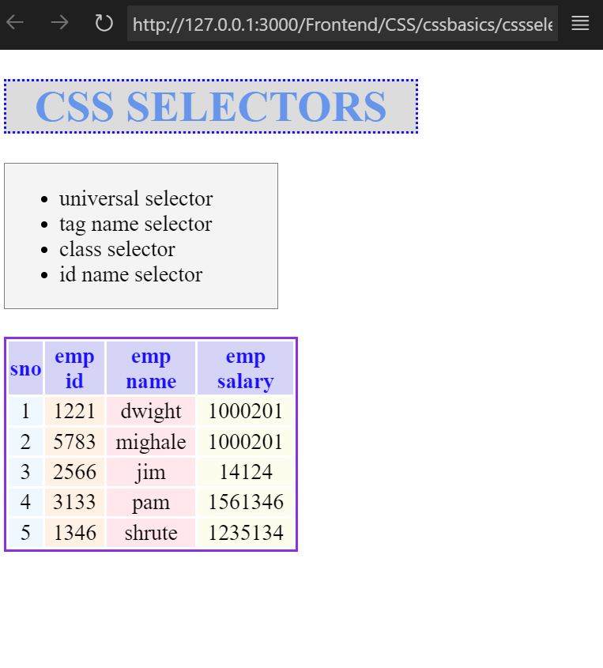
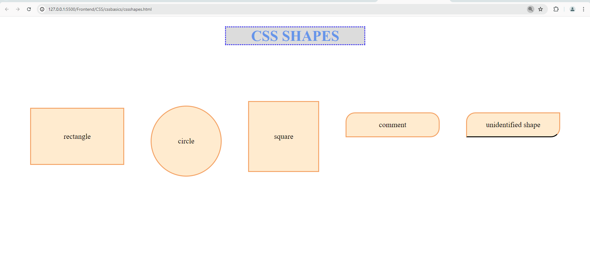
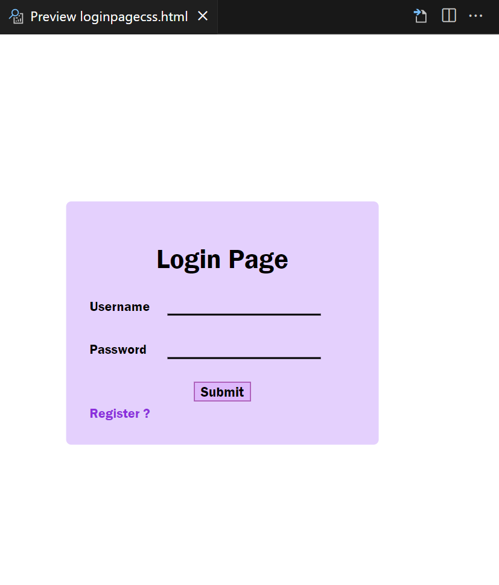

### CSS BASICS
- tag name selector and basic of css properties.

```css
background-color,
text-align,
color,
border{solid,dotted,dashed},
text-align,
cursor
```



### CSS SELECTORS

- illustrated four types of selectors.

```css
- Universal
- Tag name
- Class name
- Id name
```


### CSS SHAPES
- illustrated shapes(square,rectangle,circle,etc.) and comment-box design in css.(used flexbox for responsiveness)



### STYLING THE LOGIN PAGE
- The login page is styled which is structured in html early 

