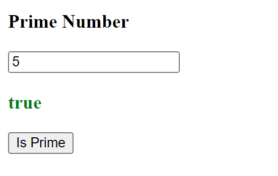
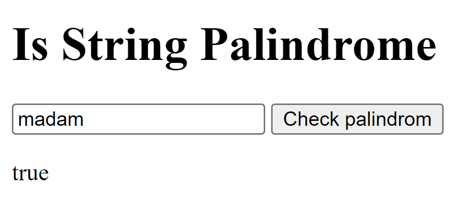
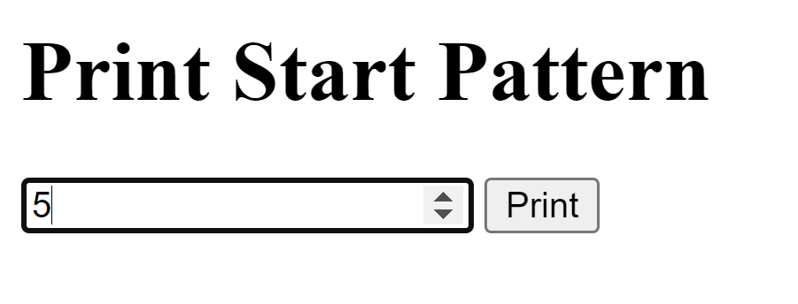
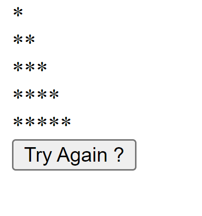
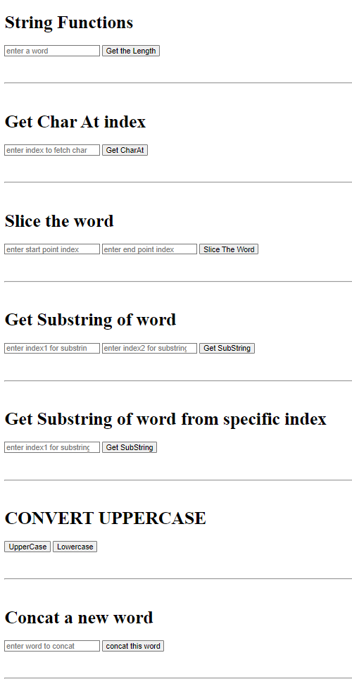
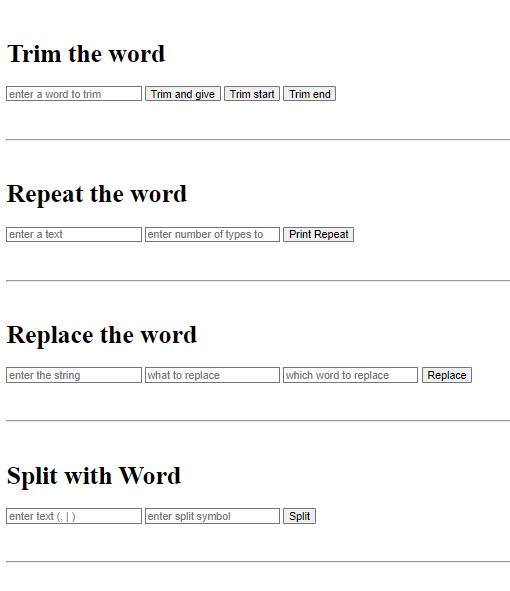
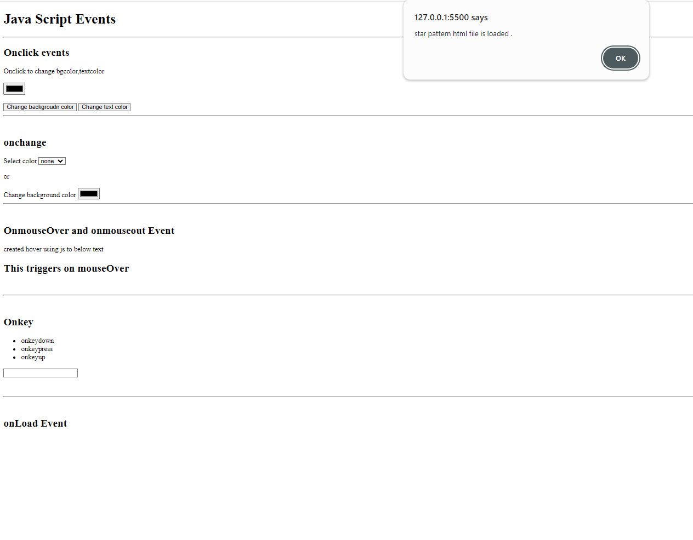
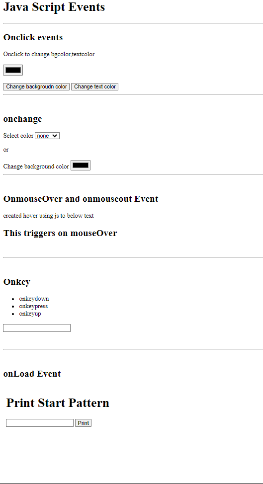
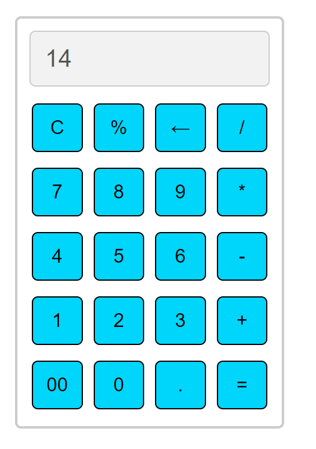

## JS ASSIGNMENT 2

## program -1 
Write a JavaScript program to check if the given number is the Prime
Numberor not
### output

## program -2
Write a JavaScript program to check if the given String is Palindrome or not

### output

### program -3
Write a JavaScript program to display the pattern as below.

## program -4

## String functions
### output

### program -5
various JavaScript Events.

### program -6
Working Calculator

