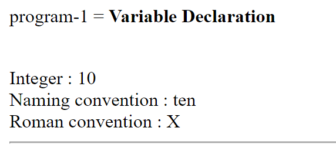
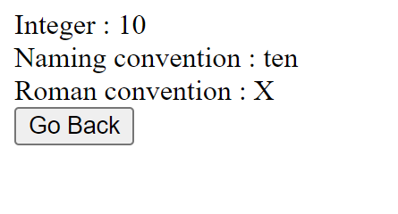
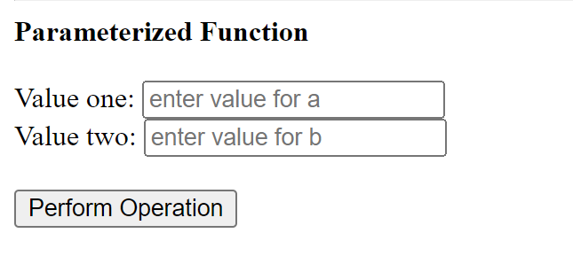
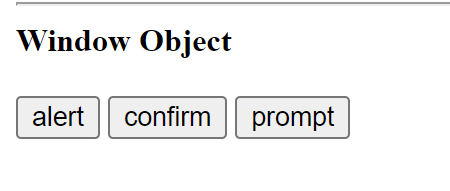
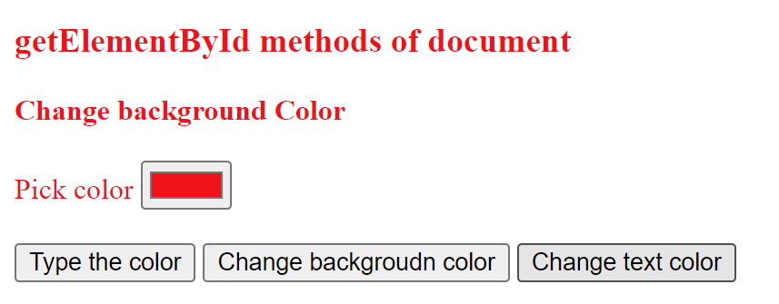
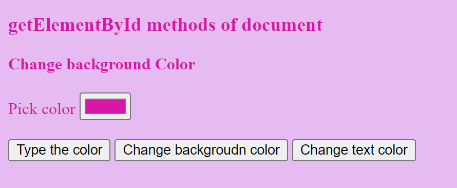
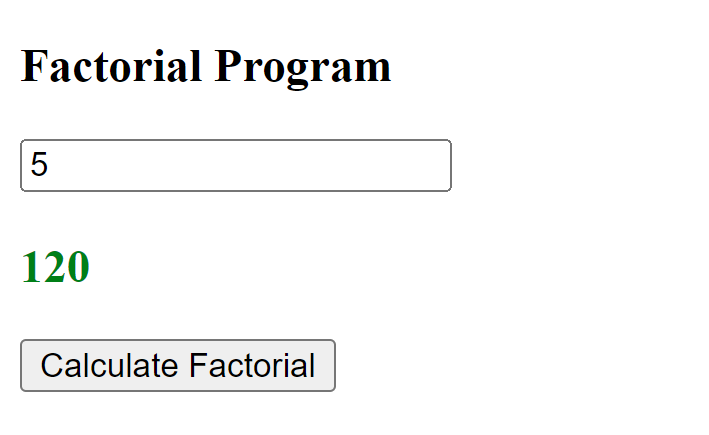
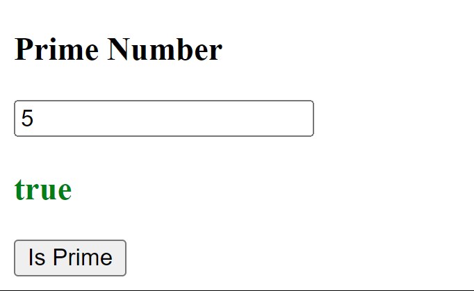

## javascript fundamentals exercises

### Program -1


### Progrm -2 



### Program -3


### Program -4


### Program -5



```js
function changebgcolor()
        {
            let colorname=document.getElementById("pickcolor").value;
            document.body.bgColor=colorname;

        }
          
function changecolorbyname(){
            let colorname=prompt("Enter the new background color")
            document.body.bgColor=colorname;
        }
    
function changetextcolor()
        {
            let colorname = document.getElementById("pickcolor").value;
            document.body.style.color=colorname;
        }
```

### Program -6 


```js
let fact=(n)=>
    {

        if(n>=1){
            return n*fact(n-1);
            }

        else{
            return 1;
        } 
                    
    }
function factorial(){
        let num=document.getElementById("num1").value*1;
        let result=fact(num);
        document.getElementById("result").innerHTML="<font color='green'>"+result+"</font>"
    }
```

### Program -7


```js
<script>
    let isprime = (n,i)=>{
        if(n<=2)
            {
                return (n===2)?true:false;
            }
        if(n%i===0)
            {
                return false;
            }
        if(i*i>n)
            {
                return true;
            }
        return isprime(n,i+1);
    }
    
function prime()
    {
        let pnum=document.("num2").value*1;
        let output=isprime(pnum,2);
        document.getElementById("output").innerHTML="<font color='green'+output+"</font>"
    }
</script>
```