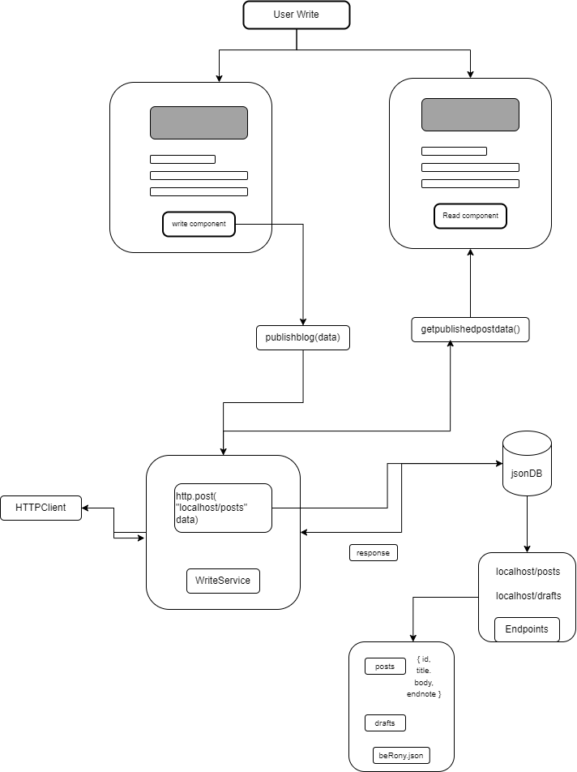

# BeRony

### Documentation

[Document](https://docs.google.com/document/d/1r846Ox72KJ1shtKyNrlCZoLMeOUpct84T4AcEgT5aqE/edit?usp=sharing)

The place where you can bring your stories to life. Whether you want to:

- **Write** your thoughts,
- **Visualize** your ideas,
- **Create videos** to share your message,

This platform has been carefully designed to showcase my learnings, memories, and more. 

So, why wait? Start creating and let the world see your work!

### Prototype

[Figma](https://www.figma.com/proto/MdKE4cZHqWNX5EfF0TskaQ/BeRony?node-id=17-27&t=LRWsNUp91I0YgKFk-1&scaling=contain&content-scaling=fixed&page-id=0%3A1&starting-point-node-id=17%3A27)

State: Development

### Workflow

### Future Features
- Authentication & Authorization
- Share blogs throughtout various social media
- Create and share video blogs or vlogs
- Reeling Blogs and vlogs
- will introduce Android,ios applications
- collaborative blogging
- monetize your ideas

## Development server

Step 1: Clone the repository.

Step 2: Navigate to the project directory.

Step 3: Run `npm install` to install all dependencies and prepare BeRony for use on the DOM

step 4: Run `ng serve` for a dev server. Navigate to `http://localhost:4200/`. The application will automatically reload if you change any of the source files.

